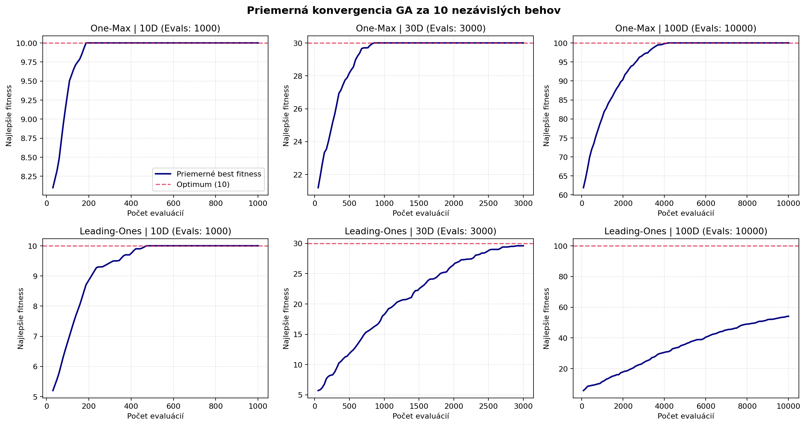

# Genetický algoritmus

Implementácia genetického algoritmu s binárnou reprezentáciou, elitizmom,
pozičnou selekciou, jednobodovým krížením a bitovou mutáciou. Otestovaná je
na problémoch **One-Max** (maximalizácia počtu jednotiek) a **Leading-Ones**
(maximalizácia počtu úvodných jednotiek).

## Nastavenie experimentu

Každá kombinácia problému a dimenzie bola spustená 10-krát. Limit bol
100 × D vyhodnotení účelovej funkcie. Použité bolo rank výber, pravdepodobnosť
kríženia 90 %, elitizmus 15 % a mutácia `max(0,8 %, 1/D)`. Veľkosť populácie
bola 30 pri D=10, 50 pri D=30 a 80 pri D=100. Náhodné semeno: 42.

## Výsledky

| Problém | D | Vyhodnotení | Najlepší | Najhorší | Priemer | Medián | Smerodajná odchýlka |
|---|---:|---:|---:|---:|---:|---:|---:|
| One-Max | 10 | 1 000 | 10/10 | 10/10 | 10,00 | 10 | 0,00 |
| One-Max | 30 | 3 000 | 30/30 | 30/30 | 30,00 | 30 | 0,00 |
| One-Max | 100 | 10 000 | 100/100 | 100/100 | 100,00 | 100 | 0,00 |
| Leading-Ones | 10 | 1 000 | 10/10 | 10/10 | 10,00 | 10 | 0,00 |
| Leading-Ones | 30 | 3 000 | 30/30 | 27/30 | 29,60 | 30 | 0,92 |
| Leading-Ones | 100 | 10 000 | 67/100 | 44/100 | 54,10 | 52 | 6,33 |

One-Max dosiahol optimum vo všetkých behoch. Leading-Ones dosiahol optimum pri
10D, takmer optimum pri 30D a pri 100D zostal priemerne na 54,1 z 100.

## Priemerná konvergencia

Graf zobrazuje priemerné najlepšie fitness počas 10 behov; červená čiara
označuje optimum.

